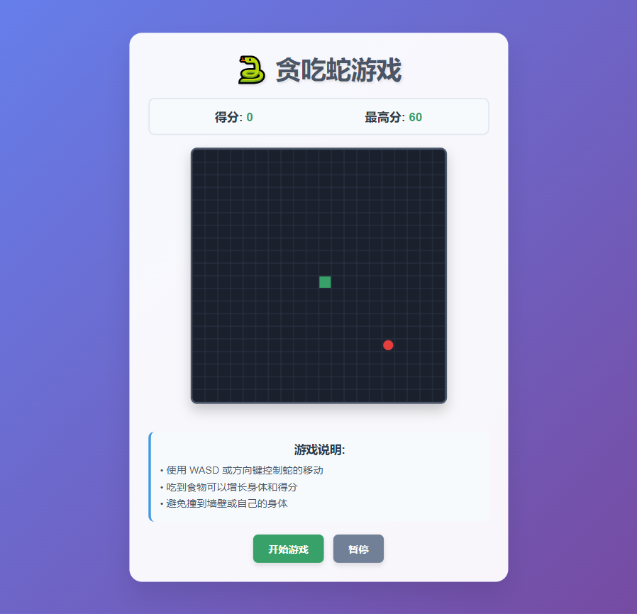
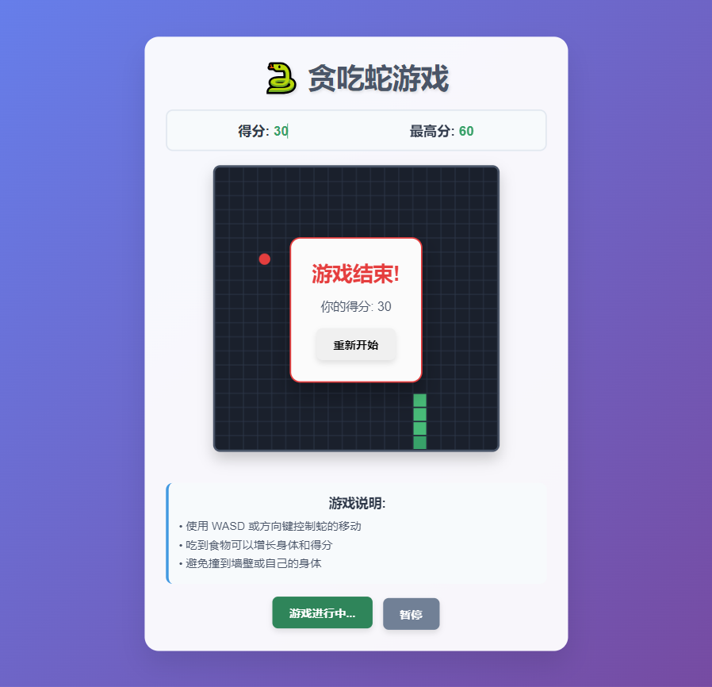

# 🐍 Snake Game

[中文](README.md) | **English**

A modern Snake game built with HTML5 Canvas and JavaScript.

## 🔗 Online Trial Play
[Click to Play Now](https://quecue.github.io/snake-game)

## 📸 Screenshots

  
  

  <em>Left: Game Start Screen | Right: Game Playing</em>

## 🎮 Game Features

- **Classic Gameplay**: Control the snake to eat food while avoiding walls and self-collision
- **Modern Interface**: Beautiful gradient backgrounds and rounded corner design
- **Responsive Design**: Supports both desktop and mobile devices
- **Multiple Control Methods**:
  - Keyboard controls: WASD or Arrow keys
  - Mobile touch buttons
- **Game Features**:
  - Real-time scoring system
  - High score tracking (local storage)
  - Pause/Resume functionality
  - Game over restart option

## 🚀 How to Run

1. Open the `index.html` file directly in your browser
2. Click the "Start Game" button
3. Use keyboard or touch buttons to control the snake's movement

## 🎯 Game Rules

1. **Movement Controls**:
   - Desktop: Use WASD keys or Arrow keys
   - Mobile: Tap the directional buttons on screen

2. **Game Objective**:
   - Control the snake to eat red food
   - Earn 10 points for each food consumed
   - Snake grows longer by one segment

3. **Game Over Conditions**:
   - Snake hits the wall
   - Snake collides with its own body

4. **Special Features**:
   - Pause: Click pause button or press Space during gameplay
   - Restart: Click restart button after game over

## 🛠️ Technical Implementation

- **Frontend Technologies**: HTML5, CSS3, JavaScript (ES6+)
- **Graphics Rendering**: HTML5 Canvas API
- **Data Storage**: localStorage (high score tracking)
- **Responsive Design**: CSS media queries
- **Compatibility**: Modern browsers (Chrome, Firefox, Safari, Edge)

## 📱 Mobile Support

The game fully supports mobile devices:
- Touch control buttons
- Responsive layout
- Adapts to different screen sizes

## 🎨 Interface Design

- Gradient background colors
- Card-style design with rounded corners
- Modern button styling
- Clear game grid
- Smooth animation effects

## 📝 Changelog

### v1.0.0
- Basic game functionality implementation
- Desktop and mobile support
- Scoring system and high score tracking
- Pause/Resume functionality
- Modern UI design

## 🤝 Contributing

Issues and improvement suggestions are welcome!

## 📄 License

MIT License - Free to use and modify
